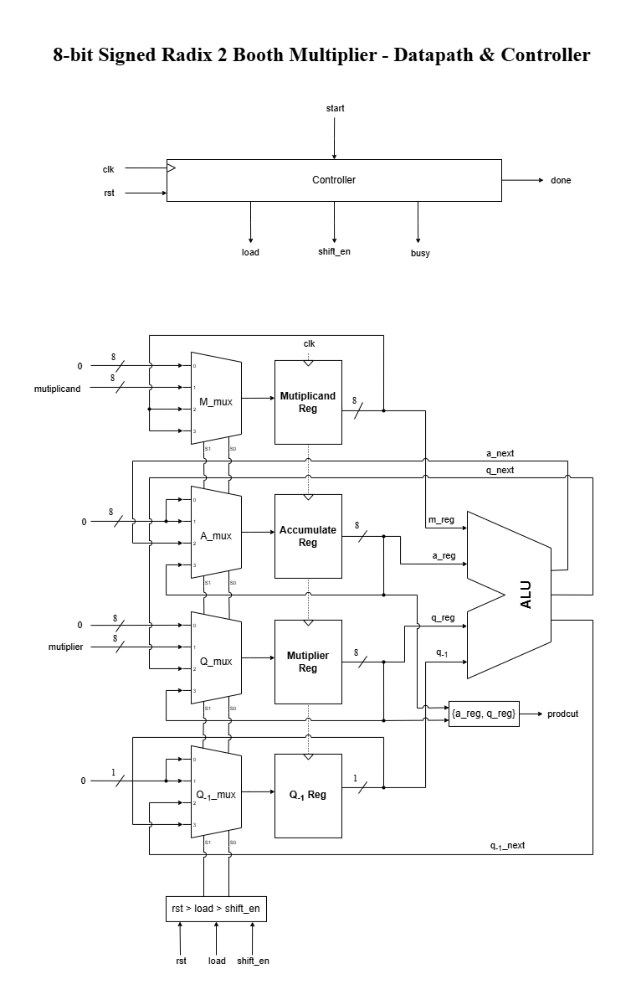
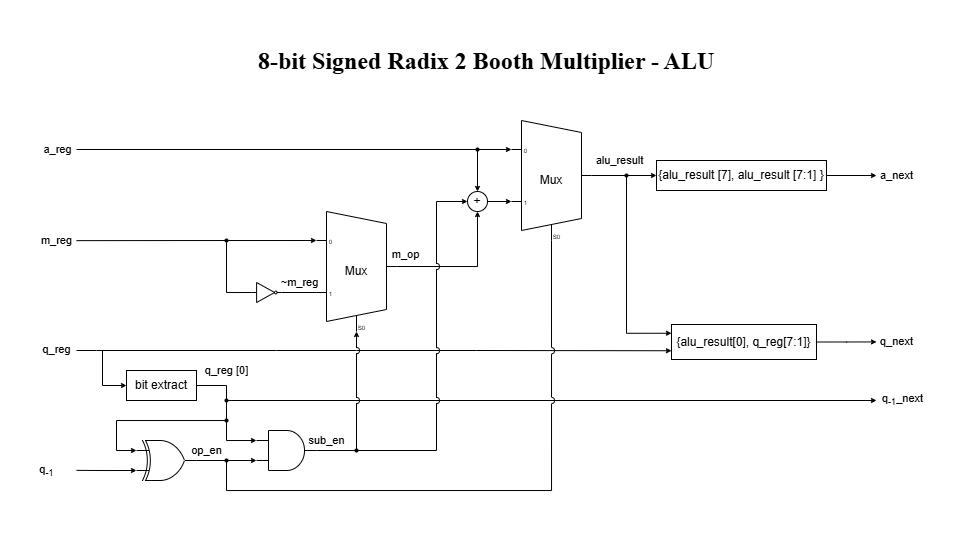
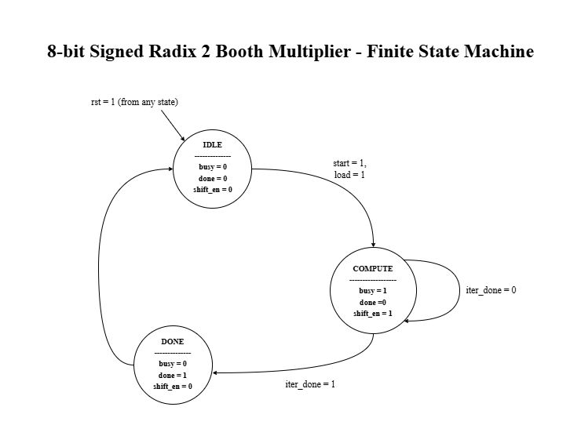

# 8-bit Signed Radix-2 Booth Multiplier

This is my implementation of a signed 8-bit Booth multiplier in SystemVerilog, done as a
2-day project. The goal was to build the multiplier as a proper sequential design (one
Booth iteration per clock) instead of just using the `*` operator, and to verify it with
a self-checking testbench instead of eyeballing waveforms.

## What's in here

```
docs/
├── known-issues.md                               write-up of the -128 multiplicand bug
├── booth_algorithm.drawio                        editable datapath/FSM/ALU diagram
├── booth_algorithm_datapath_and_controller.png   exported image of the top-level datapath/controller diagram
├── booth_algorithm_ALU.png                       exported image of the ALU diagram
├── booth_algorithm_FSM.png                       exported image of the FSM diagram
rtl/
├── booth_multiplier.sv                           top-level module, wires up controller + datapath
├── controller.sv                                 FSM (IDLE -> COMPUTE -> DONE), also holds the iteration counter
├── datapath.sv                                   registers (M, A, Q, Q-1), wires up the alu
├── alu.sv                                        Booth encoding + add/subtract + shift, all in one combinational block
tb/
├── tb_controller.sv                              tests the FSM on its own
└──tb_top.sv                                      self-checking testbench for the whole multiplier
.gitignore
README.md
```

## How it works

Booth's algorithm lets you multiply two signed numbers without treating positive and
negative operands as separate cases. Every cycle you look at the current bit of the
multiplier (Q0) and the bit below it (Q-1):

- `01` -> add the multiplicand to the accumulator
- `10` -> subtract the multiplicand from the accumulator
- `00` or `11` -> do nothing

After that you do an arithmetic right shift of the combined `{A, Q, Q`<sub>-1</sub>`}` register. Doing
this 8 times (once per bit) gives the full 16-bit signed product in `{A, Q}`.

I worked through a few examples by hand before writing any RTL, which helped a lot with
figuring out exactly when the shift should happen and what `Q`<sub>-1</sub> is actually for.

## Datapath & Controller

<p align="center">
  
</p>

## ALU

<p align="center">
  
</p>

## Finite State Machine

<p align="center">
  
</p>

*(editable source: `docs/booth_algorithm.drawio`)*

Kept the controller as small as possible - 3 states:

- **IDLE** - waiting for `start`. When it comes in, asserts `load` for one cycle and moves
  to COMPUTE.
- **COMPUTE** - stays here for 8 cycles, doing one Booth iteration per cycle (`shift_en`
  high the whole time), until `iter_done`.
- **DONE** - asserts `done` for one cycle, then goes back to IDLE.

`busy` is high the whole time it's in COMPUTE.

## Datapath

- **Registers** (inside `datapath.sv`) - holds `M`, `A`, `Q`, `Q`<sub>-1</sub>. Priority is `rst` >
  `load` > `shift_en` > hold, same as the muxes in front of each register in the diagram
  above. Only sequential (`always_ff`) part of the datapath - `alu.sv` below is all
  combinational.
- **alu** - takes `a_reg`/`m_reg`/`q_reg`/`q_m1`, outputs `a_next`/`q_next`/`q_m1_next`:
  - encoding: `op_en = q_reg[0] ^ q_m1` (add or subtract needed), `sub_en = q_reg[0] & op_en`
    (which one)
  - add/subtract: one adder reused for both - `sub_en` inverts `M` and doubles as carry-in,
    so `A - M` is just `A + ~M + 1`, no separate subtractor needed
  - shift: arithmetic right shift of `{A, Q, Q`<sub>-1</sub>`}`

Counter isn't a separate block - it's a down-counter (`count`) inside `controller.sv`,
`iter_done` is just `count == 1`.

`product[15:0]` is `{A, Q}` read off the registers once `done` is high.

## Verification

`tb_top.sv` checks the DUT against `$signed(a) * $signed(b)` and prints PASS/FAIL for each
test automatically, no waveform checking needed. It runs:

- a handful of directed cases (positive x positive, negative x negative, mixed sign, etc.)
- a full sweep of every combination of `{0, 1, -1, 127, -128}` (25 cases), since these are
  the values most likely to break something
- 500 randomized signed operand pairs

`tb_controller.sv` checks the FSM on its own - counter's inside `controller.sv` now, so
this doesn't touch `datapath.sv` or `alu.sv` at all.

The edge-case sweep currently turns up a real bug when `multiplicand = -128` -
see `docs/known-issues.md` for the root cause and the fix.

## Challenges

- Initially I had `iter_done` triggering one cycle too late, which added an extra wasted
  clock cycle at the end of every multiplication. Fixed by checking `counter == 1` instead
  of `counter == 0`, so the last iteration and the "we're done" signal happen on the same
  cycle.
- Mixing up when exactly the shift should happen relative to the add/subtract took a
  couple of tries to get right - drawing it out by hand for a small example (matching
  Booth's original 1951 paper) made it much clearer than just reading the algorithm
  description.
- Found a real bug where `multiplicand = -128` gives the right magnitude but the wrong
  sign - write-up and fix are in `docs/known-issues.md`.

## References

- A. D. Booth, *A Signed Binary Multiplication Technique*, Quarterly Journal of Mechanics
  and Applied Mathematics, 1951.
